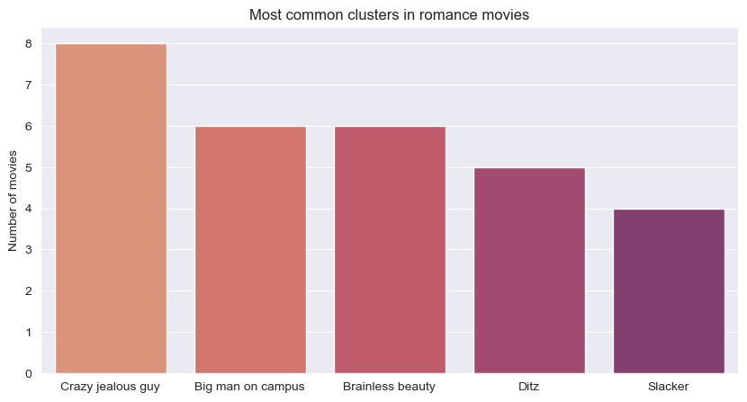

# Who is your soulmate?
## _Which characters are paired in romantic movies?_
Toestewbrr 🍲 🦶 : Antoine Bonnet, Hugo Bordereaux, Alexander Sternfeld & Marguerite Thery

## Abstract 📰

The CMU dataset contains plot summaries and metadata on movies between 1888 and 2012. In these plot summaries, love appears as the third most common noun (after father and man… #YOUGOGIRL). We aim to assess how romantic relationships are depicted in movies, by studying the two characters that are coupled in a movie. Movies reflect the culture at the time of creation, therefore this research can provide insights on how views on romance differ across time and across the world. PART REGARDING THE RESEARCH METHODS

## Research questions ❓

To gain a comprehensive understanding of the characters paired in romantic relationships in movies, we aim to answer the following questions:

1. How do the demographics differ between characters in a couple (i.e. age, ethnicity, religion, gender)?
2. Which type of personalities are coupled together?
3. How often is one person of the couple dying and what causes their death (are heart attacks more likely in romantic movies...)? 💀
4. Is there a difference in the findings in (1)-(4) for older movies?

## Methods ✒️

### General analysis
To gain a better understanding of the dataset, we first performed a general analysis. Let us show one finding from this analysis, while a thorough description and many more results can be found in `general_analysis.ipynb`. The figure below shows the runtime of romantic movies and non-romantic movies over the time. From this graph, we first note that the runtime of movies increases over time. This illustrates that movies from around 1900 are often short, such as the [Dickson Experimental Sound Film](https://en.wikipedia.org/wiki/The_Dickson_Experimental_Sound_Film). Second, we find that, on average, romantic movies are longer than non-romantic movies.  

### CoreNLP to analyze relationships
Explanation: meaning

#### Differences in demographic within a couple
Marguerite

#### Types of personalities
TV tropes as preliminarie, explain with coreNLP

#### How often is a character in a relationship dying?
Histogram with main causes of dying

#### Differences in romantic relationships for older movies
Explain how we will analyze it; show difference from gen analysis

#### Differences over time
* Type of characters and type of relationships 
  * ex: are there more personas with x characteristic in y type of relation
* Find plot summaries which contain most love related words 
* Extract information about each character (job, physical details, qualities, actions) using NLP Core on plot summaries 
* Create pairs dataframe which contain the pairs of characters which are in a romantic relationship in a movie 
* Plots: clouds/clusters. Clustering of the characters based on their features. Map each character in a loving relationship on a map based on the textual vector. Get a vector from word-to-vec from all characteristics and map it. Show the link between two characters. 
* Find dataset online which maps main components of each character
* Find type of relationships. 

## Proposed timeline ⏲️
* 19-11-2022: Submit the second milestone
* 23-11-2022: Run coreNLP augmented pipeline on all the plot summaries. 
* 25-11-2022: Extract love pairs characters with their corresponding characteristics. 
* 02-12-2022: Perform analysis on demographics and personality types between characters in a romantic relationship. 
* 09-12-2022: Run temporal analysis. Begin developing a rough draft of the datastory.
* 16-12-2022: Complete code implementation and interactive visualizations. 
* 20-12-2022: Complete datastory. 
* 23-12-2022: Hand-in the project 

## Organization within the team 💪
|            | **Task**                                                                                             |
|------------|------------------------------------------------------------------------------------------------------|
| Antoine | Develop core NLP pipeline with Marguerite   Use core NLP to describe relationships between characters |
| Marguerite | Develop core NLP pipeline with Antoine   Cluster characters by main characteristics                |
| Hugo | Refine classification for romantic words    Set up the website and learn about interactive viz with Alexander                                         |
| Alexander | Continue exploration of the dataset   Set up the website and learn about interactive viz with Hugo             |

## Questions for the TA ❔
* Find a way to label the characters or the relationships? 

