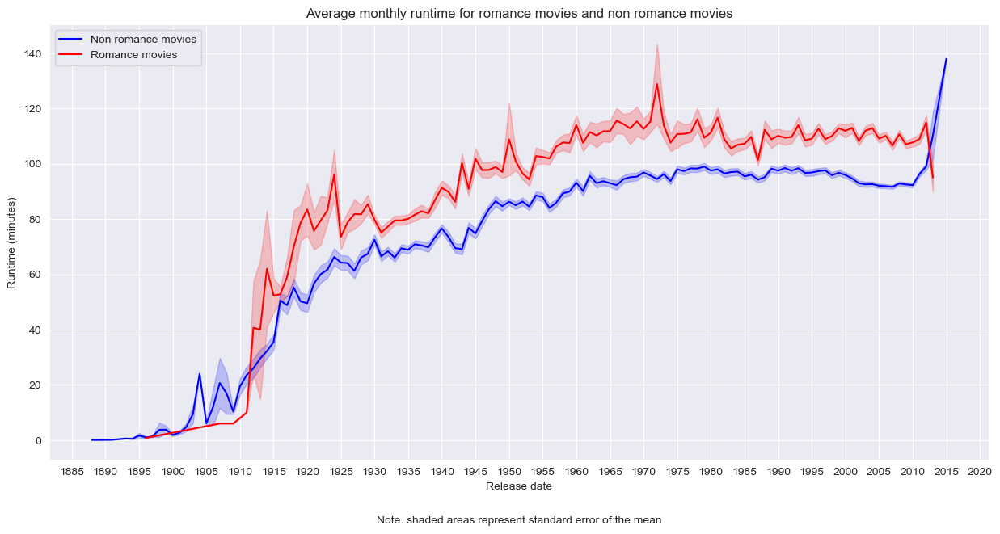
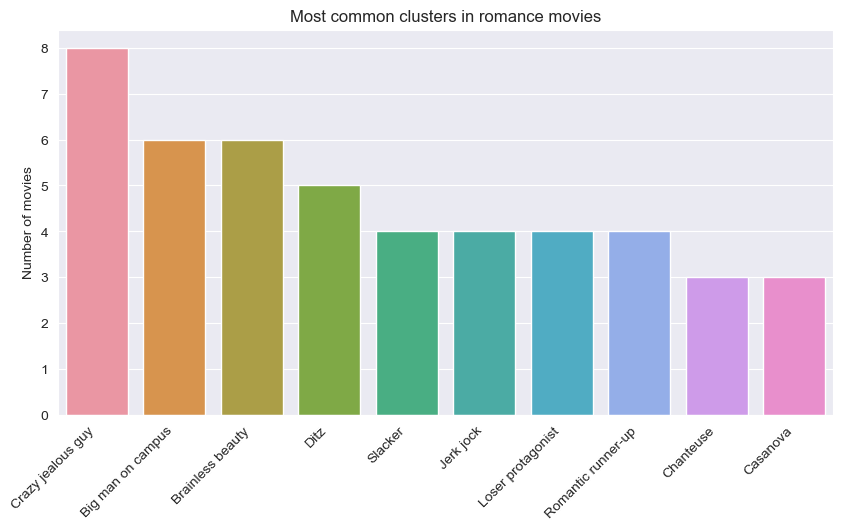

# Call Me By Your Cluster: A Data-Driven Analysis of Romantic Movies

<b>Team: ToeStewBrr 🍲 🦶</b>

Antoine Bonnet, Hugo Bordereaux, Alexander Sternfeld & Marguerite Thery

## Abstract 📰

The [CMU Movie Summary Corpus](http://www.cs.cmu.edu/~ark/personas/) contains plot summaries and metadata of 42,306 movies and 450,669 characters ranging from 1888 to 2012. Love takes a central place in movies; the word love appears as the third most common noun in these summaries (after father and man… ==#YOUGOGIRL==). We aim to assess how romantic relationships are depicted in movies, by studying which two characters are coupled in a movie. Movies reflect the culture at the time of creation, therefore this enquiry can provide insights on how views on romance differ across time and across the world.

## Research questions ❓

To gain a comprehensive understanding of the characters paired in romantic relationships in movies, we aim to answer the following questions:

1. Are there recurrent personality types among lovers?
2. Which type of personalities are coupled together?
3. Has the cinematic couple evolved over time?

## Methods ✒️

### 1. General analysis
To gain a better understanding of the provided datasets, we first performed an exploratory analysis. We show here a single finding from this analysis, while a thorough description and many more results can be found in `general_analysis.ipynb`. 

#### 1.1. Romantic movies

The figure below shows the runtime of romantic movies and non-romantic movies over time. From this graph, we first note that the runtime of movies increases over time. This illustrates that movies from around 1900 are often short, such as the [Dickson Experimental Sound Film](https://en.wikipedia.org/wiki/The_Dickson_Experimental_Sound_Film). Second, we find that, on average, romantic movies are longer than non-romantic movies.  

    

#### 1.2. Character personalities

As a first step to discovering the personalities that are matched together in a couple, we used the tv trope personality types that were part of the CMU dataset. Characters from approximately 500 movies were classified into 72 character types. When considering romantic movies, we obtained the top 5 character types that are displayed in the histogram below. For those wondering: the defining characteristics of a "ditz" are [profound stupidness or quirkiness](https://tvtropes.org/pmwiki/pmwiki.php/Main/TheDitz). 

    

Although this gives a rough sketch of the personalities, the classification of 500 movies is rather limited. Therefore, we will conduct our own analysis directly on the plot summaries to extract couples and character roles. 

### 2. CoreNLP analysis

[**CoreNLP**](https://nlp.stanford.edu/software/) is an natural language processing toolkit with vast capability created at Stanford University. Its textual analysis is run through a **pipeline** of sequential analysis steps called annotators. The full list of available annotators is available [here](https://stanfordnlp.github.io/CoreNLP/annotators.html). We will use CoreNLP to extract couples and lovers' persona from the plot summaries. 

#### 2.1. Exploring pre-existing analysis

The authors of the dataset had performed a preliminary analysis using CoreNLP on the plot summaries. This data was useful to extract the main character as the one with the highest number of mentions for each movie. Moreover, we extracted the main pair of interacting characters by using the number of common mentions within a sentence as a proxy for interaction. 

However, our end goal is to extract love relationships as well as lovers' persona. Using common mentions as a proxy for love relationships is but a shallow approximation.  We concluded that we must therefore run our own NLP analysis to extract more valuable insights. We therefore decided to build our own customized CoreNLP pipeline. 

#### 2.2. Custom CoreNLP pipeline

We now use a **custom CoreNLP pipeline** to analyze the plot summaries. A complete description of our pipeline is available in the `coreNLP_analysis.ipynb` notebook. Our custom pipeline consists of the following annotators: 

| Annotator | Description |
|------------|------------------------------------------------------------------------------------------------------|
| 1. [Tokenization (tokenize)](https://stanfordnlp.github.io/CoreNLP/tokenize.html) | Turns the whole text into tokens.  |
| 2. [Parts Of Speech (POS)](https://stanfordnlp.github.io/CoreNLP/pos.html) | Tags each token with part of speech labels (e.g. determinants, verbs and nouns). |
| 3. [Lemmatization (lemma)](https://stanfordnlp.github.io/CoreNLP/lemma.html) | Reduces each word to its lemma (e.g. *was* becomes *be*).|
| 4. [Named Entity Recognition (NER)](https://stanfordnlp.github.io/CoreNLP/ner.html) | Identifies named entities from the text, including characters, locations and organizations. |
| 5. [Constituency parsing (parse)](https://stanfordnlp.github.io/CoreNLP/parse.html) | Performs a syntactic analysis of each sentence in the form of a tree. |
| 6. [Coreference resolution (coref)](https://stanfordnlp.github.io/CoreNLP/coref.html) | Aggregates mentions of the same entities in a text (e.g. when 'Harry' and 'he' refer to the same person). |
| 7. [Dependency parsing (depparse)](https://stanfordnlp.github.io/CoreNLP/depparse.html) | Syntactic dependency parser. | 
| 8. [Natural Logic (natlog)](https://stanfordnlp.github.io/CoreNLP/natlog.html)| Identifies quantifier scope and token polarity. Required for OpenIE. |
| 9. [Open Information Extraction (OpenIE)](https://stanfordnlp.github.io/CoreNLP/openie.html) | Identifies relation between words as triples *(subject, relation, object of relation)*. |
| 10. [Knowledge Base Population (KBP)](https://stanfordnlp.github.io/CoreNLP/kbp.html) | Filters meaningful relation triples. |

Note: Due to the weakness of the computing power at our disposition, our analysis is currently restricted to [ADD NUMBER] romantic comedy movies. A broader analysis will be performed on all movies when gaining access to computing clusters.  

From our custom pipeline, we extracted couples from all romantic comedy summaries. The **NER** annotator recognizes characters, while **coref** links together all common mentions of each character. The **OpenIE** and **KBP** annotators then conveniently label love relationships between entities as `per:spouse`. By extracting these relationships, we identified [ADD NUMBER] relationships among [ADD NUMBER] different movies. 

### 3. Future analysis

We now define the methods we will use to answer our research questions. 

 > ### Are there recurrent personality types among lovers?
    
To answer this question, we will first gather as much information as possible about each character involved in a love relationship. We can obtain the main role of each lover from the KBP tag `per:title`. Additional information including actions, adjectives and attributes will be extracted from KBP relation triples with this entity as subject.

We will then cluster the above character descriptions for all movies using a BERT pre-trained transformer to embed it into a high-dimensional space. We will then perform dimensionality reduction to a 2- or 3-dimensional space. Finally, we will use a clustering algorithm such as K-means to agglomerate personality types, which will be displayed in an interactive graph. 

We will also strive to identify which personality types are most common for each gender using a gender annotator.

> ### Which type of personalities are coupled together?

We will identify whether certain persona are frequently paired together. We will also extract demographic information about each character involved in a couple through the KBP annotator, such as their age, country of origin, ethnicity, social status and religion. We will also use the corresponding actor metadata when available. We will then explore how these demographics differ between lovers. 

> ### Has the cinematic couple evolved over time?

Dividing all movies by the decade of their release, we will look at the most common personality types among couples and how they evolve through time. An interactive graph will display how the personality type clusters vary over time. 

## Proposed timeline ⏲️
* 19-11-2022: Submit the second milestone. 
* 23-11-2022: Run CoreNLP augmented pipeline on all the plot summaries. 
* 25-11-2022: Extract couples and their corresponding characteristics. 
* 02-12-2022: Perform analysis on demographics and personality types between characters in a romantic relationship. 
* 09-12-2022: Run temporal analysis. Begin developing a rough draft of the datastory.
* 16-12-2022: Complete code implementation and interactive visualizations. 
* 20-12-2022: Complete datastory. 
* 23-12-2022: Final submission.

## Organization within the team 💪
|            | **Task**                                                                                             |
|------------|------------------------------------------------------------------------------------------------------|
| Antoine | Develop core NLP pipeline with Marguerite   Use core NLP to describe relationships between characters |
| Marguerite | Develop core NLP pipeline with Antoine   Cluster characters by main characteristics                |
| Hugo | Refine classification for romantic words    Set up the website and learn about interactive viz with Alexander                                         |
| Alexander | Continue exploration of the dataset   Set up the website and learn about interactive viz with Hugo             |

## Questions for the TA ❔
* Find a way to label the characters or the relationships? 
* Which transformers and clustering methods are best suited to our needs?

## Bonus
    if (permutation(team_name) == professor_name): 
        print('Didn't you notice?')

