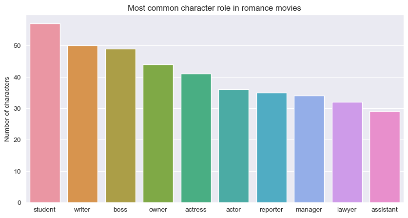

# Call Me By Your Cluster: A Data-Driven Analysis of Cinematic Love

<b>Team: ToeStewBrr 🍲 🦶</b>

Antoine Bonnet, Hugo Bordereaux, Alexander Sternfeld & Marguerite Thery

## Abstract 📰

The [CMU Movie Summary Corpus](http://www.cs.cmu.edu/~ark/personas/) contains metadata of 81,741 plot summaries and 450,669 characters ranging from 1888 to 2012. Additionally, plot summaries of 42,306 movies are provided. Love takes a central place in movies; the word love appears as the third most common noun in these summaries (after father and man… #YOUGOGIRL). We aim to assess how romantic relationships are depicted in movies, by studying which two characters are coupled in a movie. Movies reflect the culture at the time of creation, therefore this enquiry can provide insights on how views on romance differ across time and across the world. By using the OpenIE and KBP annotators from the coreNLP pipeline, we aim to identify common personalities in love movies and find frequent pairings among these personalities. Additionally, we will exploit the large time span of the dataset to study variations over time.

## Research questions ❓

To gain a comprehensive understanding of the characters paired in romantic relationships in movies, we aim to answer the following questions:

1. Are there recurrent personality types among lovers?
2. Which type of personalities are coupled together?
3. Has the cinematic couple evolved over time?

## Methods ✒️

### 1. General analysis
To gain a better understanding of the provided datasets, we first performed an exploratory analysis. Although we only present two findings in this document, a thorough description and many more results can be found in `general_analysis.ipynb`. 

#### 1.1. Genders in romantic and non-romantic movies

The figure below shows the percentage of males and females in romantic and non-romantic movies. One can see that there are more women in romantic movies compared to non-romantic movies. 

    

Furthermore, one may wonder how the percentage of females in movies developed over time. The figure below shows that there seems to be a decline in the percentage of females both in romantic and non-romantic movies during the first half of the 20th century. However, since 1960 the percentage of females has increased. This effect seems stronger in non-romantic movies.

    

#### 1.2. Character personalities

As a first step to discovering the personalities that are matched together in a couple, we used the provided TV trope personality types. Characters from approximately 500 movies were classified into 72 character types. From this, we obtained the 10 most common character types among romantic movies as shown below. For those wondering: the defining characteristics of a '*ditz*' are [profound stupidity or quirkiness](https://tvtropes.org/pmwiki/pmwiki.php/Main/TheDitz). 

    

Although this gives a rough sketch of the different personality clusters, only 500 of the 42,306 provided movies are considered in this dataset. We have therefore conducted our own analysis directly on the plot summaries to extract couples and character roles. 

### 2. CoreNLP analysis

[**CoreNLP**](https://nlp.stanford.edu/software/) is an NLP toolkit with vast capability created at Stanford University. It runs through a **pipeline** of sequential textual analysis steps called **annotators**. The full list of available annotators is available [here](https://stanfordnlp.github.io/CoreNLP/annotators.html). We will use CoreNLP to extract couples and lovers' persona from the plot summaries. 

#### 2.1. Exploring pre-existing analysis

The authors of the dataset performed a preliminary analysis of the plot summaries using CoreNLP annotators. We used this data to extract the main character and the characters' pair with the most interactions in each movie. We define the main character of a movie as the entity 'PERSON' with the highest number of occurrences in the plot summary; and the principal characters' pair of a movie as the pair with the highest number of common mentions within a sentence over the plot summary. 

However, using common mentions as a proxy for love relationships is a shallow approximation. Even if we restrict ourselves to romantic movies, the assumption that the most interacting pair of characters will be a love couple is too strong. Therefore, we decided to run a customized CoreNLP pipeline with additional annotators to extract more reliable insights. 

#### 2.2. Custom CoreNLP pipeline

We now use a **custom CoreNLP pipeline** to analyze the plot summaries. A complete description of our pipeline is available in the `coreNLP_analysis.ipynb` notebook. Our custom pipeline consists of the following annotators: 

| Annotator | Description |
|------------|------------------------------------------------------------------------------------------------------|
| 1. [Tokenization (tokenize)](https://stanfordnlp.github.io/CoreNLP/tokenize.html) | Turns the whole text into tokens.  |
| 2. [Parts Of Speech (POS)](https://stanfordnlp.github.io/CoreNLP/pos.html) | Tags each token with part of speech labels (e.g. determinants, verbs and nouns). |
| 3. [Lemmatization (lemma)](https://stanfordnlp.github.io/CoreNLP/lemma.html) | Reduces each word to its lemma (e.g. *was* becomes *be*).|
| 4. [Named Entity Recognition (NER)](https://stanfordnlp.github.io/CoreNLP/ner.html) | Identifies named entities from the text, including characters, locations and organizations. |
| 5. [Constituency parsing (parse)](https://stanfordnlp.github.io/CoreNLP/parse.html) | Performs a syntactic analysis of each sentence in the form of a tree. |
| 6. [Coreference resolution (coref)](https://stanfordnlp.github.io/CoreNLP/coref.html) | Aggregates mentions of the same entities in a text (e.g. when 'Harry' and 'he' refer to the same person). |
| 7. [Dependency parsing (depparse)](https://stanfordnlp.github.io/CoreNLP/depparse.html) | Syntactic dependency parser. | 
| 8. [Natural Logic (natlog)](https://stanfordnlp.github.io/CoreNLP/natlog.html)| Identifies quantifier scope and token polarity. Required for OpenIE. |
| 9. [Open Information Extraction (OpenIE)](https://stanfordnlp.github.io/CoreNLP/openie.html) | Identifies relation between words as triples *(subject, relation, object of relation)*. |
| 10. [Knowledge Base Population (KBP)](https://stanfordnlp.github.io/CoreNLP/kbp.html) | Filters meaningful relation triples. |

Note: Due to the weakness of the computing power at our disposition, our analysis is currently restricted to 1491 romantic comedy movies. A broader analysis will be performed on all movies when gaining access to computing clusters.  

It was important to run this customized pipeline to have **depparse** and **KBP** annotators. These annotators allow us to find the characteristics associated with each character along with demographics elements. We also used the KBP annotator to extract relationships between characters.

#### 2.3 An alternative: Word2Vec

In `textual_analysis.ipynb`, we tried to analyse the plot summaries to detect movies that depict a relationship, in another way than with coreNLP. The idea is to score each summary based on semantic proximity with words that we think are related to relationships and find a threshold that discards every film that does not involve two characters in love. Specifically, we tested the semantic similarity with the word "love". However, in this approach we face two problems. First, the word "love" is chosen rather arbitrarily. Second, we need to find a threshold for the similarity, after which we classify a word to be related to love. Therefore, we aim to continue with coreNLP.

### 3. Preliminary findings and future analysis

We now define the methods we will use to answer our research questions. 

> ### Are there recurrent personality types among lovers?
    
To answer this question, we will first gather as much information as possible about each character involved in a love relationship. As a first step, we obtained the main role of each lover from the KBP tag `per:title` with a 0.9 confidence threshold. The figure below shows the 10 most common roles among 955 romantic comedies.

    

Additional information including actions, adjectives and attributes will be extracted from depparse annotator (appos, nsubj) with this entity as subject and KBP triple relationships. We will then cluster the above character descriptions for all movies using a BERT pre-trained transformer to embed it into a high-dimensional space. We will then perform dimensionality reduction to a 2- or 3-dimensional space. Finally, we will use a clustering algorithm such as K-means to agglomerate personality types, which will be displayed in an interactive graph. We will also strive to identify which personality types are most common for each gender by using a gender annotator.

> ### Which type of personalities are coupled together?

From our custom pipeline, we extracted couples from all romantic comedy summaries. The **NER** annotator recognizes characters, while **coref** links together all common mentions of each character. The **KBP** annotators then conveniently label love relationships between entities as `per:spouse`. By extracting these relationships with a 0.9 confidence threshold, we identified 685 relationships among 254 different romantic comedy movies. We notice some self-relationships and some relationships where the subject or the object of the relation was not a character (ex: she, him). We filtered out these relations to observe the distribution of the number of relations per movie. 

    

We saw that in most movies the two characters love each other (2 relations: Harry loves Sally and Sally loves Harry) even if there is still a high number of movies where the love is not-reciprocal (1 relation). We will run this pipeline over all the plot summaries (and not only romantic commedies) to have a bigger overview of cinematic couples.  

Once we have extracted couples from all the movies, we will identify whether certain persona are frequently paired together. We will use our previous analysis about characters' personalities and demographics to explore the differences between lovers. 

> ### Has the cinematic couple evolved over time?

Dividing all movies by the decade of their release, we will look at the most common personality types among couples and how they evolve through time. An interactive graph will display how the personality type clusters vary over time. 

## Proposed timeline ⏲️
* 19-11-2022: Submit the second milestone. 
* 23-11-2022: Run CoreNLP augmented pipeline on all the plot summaries. 
* 25-11-2022: Extract couples and their corresponding characteristics. 
* 02-12-2022: Perform analysis on demographics and personality types between characters in a romantic relationship. 
* 09-12-2022: Run temporal analysis. Begin developing a rough draft of the datastory.
* 16-12-2022: Complete code implementation and interactive visualizations. 
* 20-12-2022: Complete datastory. 
* 23-12-2022: Final submission.

## Organization within the team 💪
|            | **Task**                                                                                             |
|------------|------------------------------------------------------------------------------------------------------|
| Antoine | Develop core NLP pipeline with Marguerite   Use core NLP to describe relationships between characters |
| Marguerite | Develop core NLP pipeline with Antoine   Cluster characters by main characteristics                |
| Hugo | Refine classification for romantic words    Set up the website and learn about interactive viz with Alexander                                         |
| Alexander | Continue exploration of the dataset   Set up the website and learn about interactive viz with Hugo             |

## Questions for the TA ❔
* Do you have a recommendation for learning interactive visualizations?
* Which transformers and clustering methods are best suited to our needs?

## Bonus
    if (permutation(team_name) == professor_name): 
        print('Didn't you notice?')

